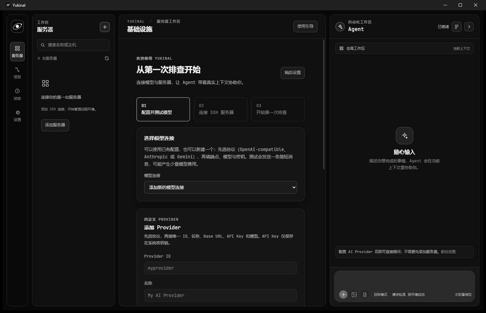
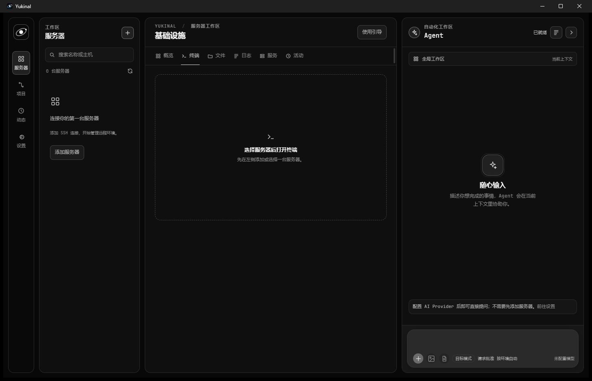

# Yukinal

[](./LICENSE)
[](https://github.com/Bad0RANG3/Yukinal/actions/workflows/check.yml)
[](./docs/changelog.md)

> 把 SSH、服务器状态和可审批的 AI Agent 放进一个桌面工作区。

Yukinal 面向需要管理远程开发环境和基础设施的人。它把服务器连接、健康快照、终端、远程文件、服务与日志、活动记录，以及 Agent 对话放在同一个窗口里。

它的核心取舍很简单：Agent 可以提出操作，但不能直接碰服务器。每次工具调用都要经过 Permission Engine；Rust 宿主会在已经解析和校验过的目标上执行操作，并把请求、授权和结果记录下来。

### 界面预览

下面的截图来自真实 Yukinal Tauri 窗口，使用临时空白数据目录生成，不包含个人服务器、凭据或模型配置。

| 工作区与 Agent | 终端工作区 |
| --- | --- |
|  |  |

左图展示首次使用引导和 Agent 面板；右图展示终端页的 PTY 工作区布局。没有选择服务器时，终端会明确提示下一步，而不会伪造远程 shell 输出。

## 项目状态

当前版本为 `1.0.0`，作为首个稳定的跨层接口基线。版本号唯一来源是 [`packages/shared/src/version.ts`](./packages/shared/src/version.ts)，跨 TypeScript、Rust、Tauri 配置和 IPC fixture 的版本一致性由测试守护。

当前状态需要注意：

- Windows 安装包已经可以构建，但目前未签名，也没有完成安装后的启动验收。
- macOS 与 Linux 安装包需要在对应平台构建；本机尚未对它们做真实产物验证。
- Provider、MCP、多模态输入、文件并发修改等边界仍有明确限制，完整清单见[当前限制](./docs/limitations.md#当前限制)。

## 今天真正可用的能力

### 服务器工作区

- 管理多台 SSH 服务器，保存连接配置，并在首次连接时处理主机指纹；密码、私钥和其他 secret 交给操作系统凭据库保存。
- 查看 OS、CPU、内存、运行时长、磁盘、网络和 Docker 等健康快照。
- 使用多会话 PTY 终端、SFTP 远程文件浏览，以及有上限的文本读取。
- 查看服务和日志；探测不到时明确返回 `unavailable`，不会用假数据填充界面。
- 记录连接、配置变更和 Agent 工具执行，方便回看一次操作是如何发生的。

### Agent 工作流

- 使用 Node.js sidecar 执行完整的 agent loop：组装上下文、调用模型、请求授权、执行工具、回灌结果，再进入下一轮。
- 内置服务器信息、Docker、文件读写和编辑等工具；真正的 SSH、SFTP、SQLite、凭据和进程资源由 Rust 宿主持有。
- 运行模式与批准方式分开控制：`goal`、`plan`、`readonly` 决定允许改变什么，`ask`、`auto` 决定由谁确认。
- 支持流式回答、工具调用卡片、逐项审批、停止运行、模型选择、会话历史和活动追踪。
- 支持图片、PDF、UTF-8 文本文件与音频附件，并按内容特征和大小上限校验；具体 Provider 的输入能力仍以[当前限制](./docs/limitations.md#当前限制)为准。

### Provider 与 MCP

- 支持 OpenAI-compatible（Chat Completions / Responses）、Anthropic Messages 和 Gemini `generateContent` 三类协议。
- 支持模型目录、SSE 文本增量、工具调用增量、取消、超时和安全的错误摘要。
- 支持 stdio 与 Streamable HTTP MCP 服务器；HTTP 端点可使用静态认证头或 OAuth，凭据仍由系统凭据库持有。
- MCP 工具进入和内置工具相同的执行链路，但默认按 `critical` 处理，必须逐项审批。

### 安全边界

Yukinal 把模型当作“提议者”，而不是拥有 shell 的操作者：

```text
React 界面
    │ 白名单 Tauri IPC
    ▼
Rust 宿主 ── SSH / SFTP / PTY ──► 远程服务器
    │
    └── NDJSON JSON-RPC ──► Node.js Agent ── HTTPS / SSE ──► 模型 Provider
                              │
                              └── Permission Engine：决定执行、询问或拒绝
```

执行前会综合工具风险、命令风险和目标环境；危险动作不能通过提示词或长期授权绕过逐项审批。凭据、主机身份、数据边界和权限档位的完整规则放在 [`docs/`](./docs/README.md) 中，而不是重复写在这里。

## 快速开始

### 前置条件

- Node.js `>= 24`
- pnpm `11.8.0`
- Rust `1.85+`，并包含 `rustfmt` 与 `clippy`
- 当前平台所需的 Tauri 2 系统依赖

完整环境清单见[开始开发](./docs/development.md#开始开发)。

### 安装与校验

```bash
pnpm install
pnpm check
```

`pnpm check` 是本地和 CI 共用的门禁，包含文档链接、凭据扫描、跨层契约、类型检查、单元测试、sidecar 冒烟、打包契约以及 Rust 检查。

### 启动

启动完整桌面应用：

```bash
pnpm --filter @yukinal/desktop tauri dev
```

只预览 React 界面：

```bash
pnpm desktop:dev
# http://127.0.0.1:1420/
```

浏览器预览只用于界面开发，不提供 SQLite、SSH、PTY、系统凭据库、MCP 子进程或 Agent 原生能力。

首次打开桌面应用后，按「使用引导」完成三步：

1. 在「设置 → Provider」中保存并测试模型连接。
2. 添加服务器，核验主机身份后连接 SSH。
3. 让 Agent 生成一次只读健康巡检草稿，确认内容后再发送。

### 构建安装包

```bash
pnpm package
```

安装包输出到 `target/release/bundle/`。当前实际跑通过的是 Windows NSIS 与 MSI；签名、公证、自动更新和跨平台安装后的验收仍不在本版本承诺内，详见[打包与分发](./docs/packaging.md#打包与分发)。

## 项目结构

```text
apps/desktop/       React 19 + Vite 界面，以及 Tauri Rust 外壳
apps/agent/         Node.js Agent loop、工具、权限引擎和 Provider
packages/shared/    TypeScript/Rust 共用的 IPC、事件、协议与 schema 契约
packages/*-sdk/     Provider 与 Agent SDK
crates/             SSH、PTY、采集、SQLite、凭据、文件系统和宿主核心
docs/               架构、权限、安全边界、限制、开发和发布文档
scripts/            校验、冒烟、打包和桌面窗口辅助脚本
```

## 文档

| 文档 | 用途 |
| --- | --- |
| [文档索引](./docs/README.md) | 阅读顺序与文档治理规则 |
| [架构总览](./docs/architecture.md) | 分层边界、运行链路和仓库地图 |
| [执行与授权模型](./docs/execution-model.md) | 风险事实、授权票据和 Agent 执行流程 |
| [安全与数据边界](./docs/security.md) | 凭据、主机身份、数据上限和审计 |
| [当前限制](./docs/limitations.md) | 已知缺口与有意保留的安全边界 |
| [开始开发](./docs/development.md) | 环境、启动方式、首次使用和验证命令 |
| [打包与分发](./docs/packaging.md) | 安装包、sidecar 资源和平台状态 |
| [Provider 边界](./docs/boundaries/provider.md) · [MCP 边界](./docs/boundaries/mcp.md) | 接入协议与跨模块约束 |
| [贡献指南](./CONTRIBUTING.md) · [安全策略](./SECURITY.md) | 参与项目与报告安全问题 |

## 许可证

项目原创代码与文档以 [MIT License](./LICENSE) 发布。第三方依赖和随仓库分发的字体仍受各自许可证约束，详见 [NOTICE](./NOTICE)。
